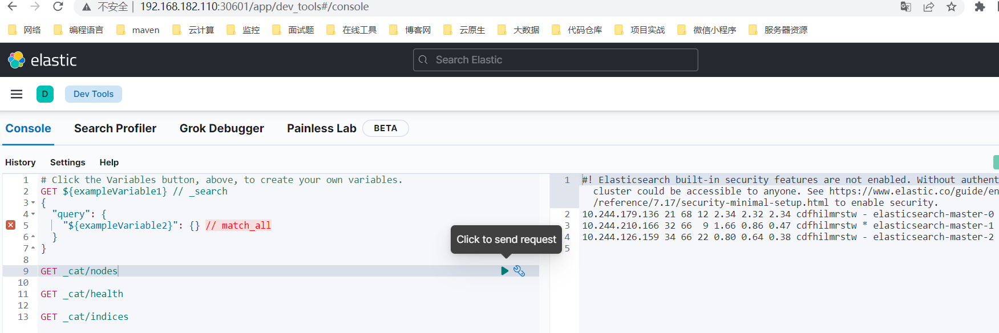

## 一、概述
在 `Kubernetes（K8s）`上运行 `Elasticsearch` 是一种在容器化环境中部署和管理 `Elasticsearch` 集群的常见方法。`Elasticsearch` 是一款流行的分布式搜索和分析引擎，而 `Kubernetes` 则提供了一个出色的平台，用于编排容器并管理 Elasticsearch 的可伸缩性和容错性。

以下是在 `Kubernetes` 上部署 `Elasticsearch` 的一般步骤：

1. **安装 Kubernetes 集群**：确保你已经运行起了 Kubernetes 集群。你可以使用托管的 Kubernetes 服务，如 Google Kubernetes Engine（GKE）、Amazon Elastic Kubernetes Service（EKS），或者使用工具如 Minikube、kubeadm 或 kops 自行部署一个集群。

2. **存储**：Elasticsearch 需要持久化存储来存储其数据。你可以使用 Kubernetes 的持久卷（PVs）和持久卷声明（PVCs）来为 Elasticsearch 数据分配存储。确保选择适合你需求的存储解决方案，如 hostPath、本地存储或网络附加存储（NAS）。

3. **Elasticsearch YAML 配置**：创建一个 YAML 配置文件，用于定义你的 Elasticsearch 集群。此文件应包括 Elasticsearch Pod、Service、ConfigMap 和任何所需的环境变量的规范。你可以使用官方的 Elasticsearch Helm 图表或编写自定义的 Kubernetes YAML 文件。

4. **Pod 反亲和性**：为了确保高可用性，配置反亲和性规则以防止多个 Elasticsearch Pod 在同一节点上运行。这有助于在不同节点上分布 Elasticsearch Pod 以提高容错性。

5. **服务发现**：使用 Kubernetes Service 来在内部或外部暴露你的 Elasticsearch 集群，具体取决于你的需求。外部访问通常涉及创建 LoadBalancer 或 NodePort 服务，而内部访问可能使用 ClusterIP 服务。

6. **密钥管理**：使用 Kubernetes Secrets 来安全存储诸如密码和身份验证令牌等敏感信息。Elasticsearch 需要安全设置来控制访问。

7. **监控和日志记录**：实施监控和日志记录解决方案，如 Prometheus、Grafana 和 Elasticsearch 自身的监控功能，以跟踪集群的健康和性能。

8. **扩展和更新**：Kubernetes 可以相对容易地通过添加或删除节点来水平扩展 Elasticsearch 集群。在更新 Elasticsearch 版本或配置时，请确保有适当的升级策略，以最小化中断。

9. **备份和灾难恢复**：建立备份和灾难恢复程序，以保护数据和集群的完整性。

10. **安全和访问控制**：实施适当的安全措施，包括身份验证、授权和网络策略，以保护你的 Elasticsearch 集群。

11. **测试**：在 Kubernetes 上彻底测试你的 Elasticsearch 部署，以确保它在不同工作负载下表现如预期。

12. **文档**：为将来的参考和你的团队的利益，记录你的设置、配置和部署过程。

虽然这些步骤提供了在 Kubernetes 上部署 Elasticsearch 的高层次概述，但具体的步骤可能会根据你的用例和环境而有所不同。考虑使用 Kubernetes Operators、Helm 图表或其他工具来简化在 Kubernetes 中部署和管理 Elasticsearch 集群的过程。此外，请参考 Elasticsearch 和 Kubernetes 文档，获取详细的说明和最佳实践。


之前也写过关于很多关于 ElasticSearch 的文章，可以参考看看：
- [【云原生】Elasticsearch + kibana on k8s 讲解与实战操作](https://mp.weixin.qq.com/s?__biz=MzI3MDM5NjgwNg==&mid=2247486614&idx=1&sn=a63433c801abe53f595ddee5c6f34d53&chksm=ead0f07fdda779696b2df5b92dacddea011d5dc42c333ec7cc7d86bc737fe61a9d7aa4b8ed0d#rd)
- [Elasticsearch 7.x文档基本操作（CRUD）](https://mp.weixin.qq.com/s?__biz=MzI3MDM5NjgwNg==&mid=2247487601&idx=1&sn=fe9d8e850975393e428b08684f87b2c4&chksm=ead0ec98dda7658e4ab0ff658c63f5d7df156cd3b833df9450eb7dad60ba88622a51581d8752#rd)
- [Elasticsearch（ELK）集群环境部署](https://mp.weixin.qq.com/s?__biz=MzI3MDM5NjgwNg==&mid=2247487596&idx=1&sn=d87c696b898bff79e7a071a722dab3dd&chksm=ead0ec85dda76593533b5512f8b75b38113317ff1c97af72d8ef455461c549fe3ad0b142486d#rd)
- [企业级日志系统架构——ELK（Elasticsearch、Filebeat、Kafka、Logstash、Kibana）](https://mp.weixin.qq.com/s?__biz=MzI3MDM5NjgwNg==&mid=2247486206&idx=1&sn=24f6d310e6a6482d5bceb201def16597&chksm=ead0f617dda77f0197734025747681daa75697441d8e0107434b78629f00c610cabb23fcd585#rd)
- [分布式实时搜索和分析引擎——Elasticsearch
](https://mp.weixin.qq.com/s?__biz=MzI3MDM5NjgwNg==&mid=2247485116&idx=1&sn=adc1ead91f8032ea42c69d7f4e477d19&chksm=ead0fa55dda77343970afd235586372b4632e668a55a8a6f18c5335bb6e48764126dbbdc7c3d#rd)

## 二、ElasticSearch 节点类型与作用
Elasticsearch 节点类型和配置在集群的设计和性能优化中起着关键作用。以下是一些常见的 Elasticsearch 节点类型以及它们的配置示例：

- **主节点 (Master Nodes)**：

**作用**：主节点用于管理集群状态、索引创建和分片分配。它们不负责数据存储或搜索查询。

配置示例：

```bash
node.master: true
node.data: false
```

- **数据节点 (Data Nodes)**：

**作用**：数据节点存储索引数据并执行搜索查询。

配置示例：

```bash
node.master: false
node.data: true
```

- **协调节点 (Coordinator Nodes)：**

**作用**：协调节点用于接收客户端请求，并将其路由到数据节点。
配置示例：

```bash
node.master: false
node.data: false
```

- **仲裁节点 (Arbitrator Nodes)**：

**作用**：仲裁节点不存储数据，但可以参与主节点选举。
配置示例：

```bash
node.master: true
node.data: false
```

- **Ingest 节点：**

**作用**：Ingest 节点用于文档的预处理和转换。
配置示例：

```bash
node.master: false
node.data: false
node.ingest: true
```

- **Machine Learning 节点：**

**作用**：Machine Learning 节点用于运行 Elasticsearch 的机器学习任务。
配置示例：

```bash
node.ml: true
```

- **Transform 节点：**

**作用**：Transform 节点用于执行数据转换操作，将结果存储在新的索引中。
配置示例：

```bash
node.transform: true
```

- **Remote 节点：**

**作用**：Remote 节点用于转发请求到远程 Elasticsearch 集群。
配置示例：

```bash
node.remote_cluster_client: true
```

- **Hot-Warm-Cold 节点：**

**作用**：Hot 节点用于接收实时数据，Warm 节点用于冷热数据分离，Cold 节点用于长期存储。
配置示例：

```bash
node.attr.hot: true
node.attr.warm: true
node.attr.cold: true
```

> 请注意，上述示例是典型的节点类型和配置示例。在实际的集群配置中，可以根据需求和性能要求进行更详细的调整。配置文件通常是 `Elasticsearch` 的 `elasticsearch.yml`，你可以在每个节点上的该文件中设置节点类型和其他相关配置。根据需要，你可以将不同的节点类型配置在不同的节点上，以构建具有适当角色的 `Elasticsearch` 集群。同时，还可以使用其他设置来调整内存、存储、网络和性能参数，以满足特定的用例需求。

## 三、K8s 集群部署
k8s 环境安装之前写过很多文档，可以参考我以下几篇文章：

- [【云原生】k8s 离线部署讲解和实战操作](https://mp.weixin.qq.com/s?__biz=MzI3MDM5NjgwNg==&mid=2247486688&idx=1&sn=e041392d219869c75cf36cca17ad81e5&chksm=ead0f009dda7791f8ef5221e49782d36b74426b6f406d22018b69e6322b3de40a215740eb4a1#rd)
- [【云原生】k8s 环境快速部署（一小时以内部署完）](https://mp.weixin.qq.com/s?__biz=MzI3MDM5NjgwNg==&mid=2247486963&idx=1&sn=c1c094f338d88c44c5b573cb2dd0b10f&chksm=ead0f11adda7780cd32d0e87ac30db538b834668b6948b91ebf3db7b1a05cf5819fcd6f41506#rd)
## 四、ElasticSearch on K8s 开始部署
### 1）下载安装包
地址：[https://artifacthub.io/packages/helm/elastic/elasticsearch](https://artifacthub.io/packages/helm/elastic/elasticsearch)

```bash
# 添加数据源
helm repo add elastic https://helm.elastic.co

# 下载
helm pull elastic/elasticsearch --version 7.17.3

# 解压
tar -xf elasticsearch-7.17.3.tgz
```
### 2）构建镜像
Elasticsearch 各版本下载地址：[https://www.elastic.co/cn/downloads/past-releases#elasticsearch](https://www.elastic.co/cn/downloads/past-releases#elasticsearch)

这里就不重新构建镜像了，有不知道怎么构建镜像的小伙伴可以给我留言或私信，这里是将远程的镜像推送到我们本地harbor，加速拉取镜像。
```bash
docker pull docker.elastic.co/elasticsearch/elasticsearch:7.17.3
docker tag docker.elastic.co/elasticsearch/elasticsearch:7.17.3  registry.cn-hangzhou.aliyuncs.com/bigdata_cloudnative/elasticsearch:7.17.3

# 上传镜像到阿里云镜像仓库
docker push registry.cn-hangzhou.aliyuncs.com/bigdata_cloudnative/elasticsearch:7.17.3
```
### 3）修改yaml编排
这里只显示修改部分，在最后会提供修改后的git下载地址。
- `elasticsearch/values.yaml`
```yaml
image: "registry.cn-hangzhou.aliyuncs.com/bigdata_cloudnative/elasticsearch"

### 去掉这几行
volumeClaimTemplate:
  accessModes: ["ReadWriteOnce"]
  resources:
    requests:
      storage: 30Gi

persistence:
  enabled: true
  labels:
    # Add default labels for the volumeClaimTemplate of the StatefulSet
    enabled: false
  annotations: {}
  accessModes:
    - ReadWriteOnce
  size: 1Gi
  storageClass: "elasticsearch-local-storage"
  local:
  - name: elasticsearch-0
    host: "local-168-182-110"
    path: "/opt/bigdata/servers/elasticsearch/data/data1"
  - name: elasticsearch-1
    host: "local-168-182-111"
    path: "/opt/bigdata/servers/elasticsearch/data/data1"
  - name: elasticsearch-2
    host: "local-168-182-112"
    path: "/opt/bigdata/servers/elasticsearch/data/data1"

protocol: http
httpPort: 9200
transportPort: 9300
service:
  enabled: true
  type: NodePort
  nodePort: 30920
  httpPortName: http
```
- `elasticsearch/templates/storage-class.yaml`

```yaml
kind: StorageClass
apiVersion: storage.k8s.io/v1
metadata:
  name: {{ .Values.persistence.storageClass }}
provisioner: kubernetes.io/no-provisioner
```
- `elasticsearch/templates/pv.yaml`

```yaml
{{- range .Values.persistence.local }}
---
apiVersion: v1
kind: PersistentVolume
metadata:
  name: {{ .name }}
  labels:
    name: {{ .name }}
spec:
  storageClassName: {{ $.Values.persistence.storageClass }}
  capacity:
    storage: {{ $.Values.persistence.size }}
  accessModes:
  {{- range $.Values.persistence.accessModes }}
    - {{ . | quote }}
  {{- end }}
  local:
    path: {{ .path }}
  nodeAffinity:
    required:
      nodeSelectorTerms:
        - matchExpressions:
            - key: kubernetes.io/hostname
              operator: In
              values:
                - {{ .host }}
---
{{- end }}
```
- `elasticsearch/templates/statefulset.yaml`

```yaml
spec:
  volumeClaimTemplates:
    spec:
# 去掉这行
{{ toYaml .Values.volumeClaimTemplate | indent 6 }}

# 新增以下内容：
      accessModes:
      {{- range .Values.persistence.accessModes }}
      - {{ . | quote }}
      {{- end }}
      resources:
        requests:
          storage: {{ .Values.persistence.size | quote }}
    {{- if .Values.persistence.storageClass }}
    {{- if (eq "-" .Values.persistence.storageClass) }}
      storageClassName: ""
    {{- else }}
      storageClassName: "{{ .Values.persistence.storageClass }}"
    {{- end }}
    {{- end }}
```
### 4）开始部署

```bash
# 如果没有挂载目录，则需要提前创建，也可自己更换挂载目录
# 先创建本地存储目录
mkdir -p /opt/bigdata/servers/elasticsearch/data/data1
chmod -R 777 /opt/bigdata/servers/elasticsearch/data/data1

helm install my-elasticsearch ./elasticsearch -n elasticsearch --create-namespace
# 查看
helm get notes my-elasticsearch -n elasticsearch
kubectl get pods,svc -n elasticsearch -owide

# 查看日志
kubectl logs -f elasticsearch-master-0 -n elasticsearch
```
notes，可以获取用户密码

```bash
NAME: my-elasticsearch
LAST DEPLOYED: Sat Sep  9 22:01:15 2023
NAMESPACE: elasticsearch
STATUS: deployed
REVISION: 1
NOTES:
1. Watch all cluster members come up.
  $ kubectl get pods --namespace=elasticsearch -l app=elasticsearch-master -w
2. Retrieve elastic user's password.
  $ kubectl get secrets --namespace=elasticsearch elasticsearch-master-credentials -ojsonpath='{.data.password}' | base64 -d
3. Test cluster health using Helm test.
  $ helm --namespace=elasticsearch test my-elasticsearch
```
### 5）测试

账号：`elastic`
密码获取：

```bash
kubectl get secrets --namespace=elasticsearch elasticsearch-master-credentials -ojsonpath='{.data.password}' | base64 -d
```
curl 访问：
```bash
curl http://192.168.182.110:30920/
curl http://192.168.182.110:30920/_cat/nodes
curl http://192.168.182.110:30920/_cat/health?pretty
```


### 6）elasticsearch-head
elasticsearch-head GitHub下载地址：[https://github.com/mobz/elasticsearch-head](https://github.com/mobz/elasticsearch-head)
Google 浏览器 `elasticsearch-head` 插件：

> 链接：[https://pan.baidu.com/s/1kYcTjBDPmSWVzsku2hEW7w?pwd=67v4](https://pan.baidu.com/s/1kYcTjBDPmSWVzsku2hEW7w?pwd=67v4)
提取码：`67v4`
### 5）卸载

```bash
helm uninstall my-elasticsearch -n elasticsearch

# 删除数据
rm -fr /opt/bigdata/servers/elasticsearch/data/data1/*
```
## 五、Kibana 编排部署
地址：[https://artifacthub.io/packages/helm/bitnami/kibana?modal=install](https://artifacthub.io/packages/helm/bitnami/kibana?modal=install)

### 1）下载安装包

```bash
helm repo add bitnami https://charts.bitnami.com/bitnami
helm pull bitnami/kibana --version 10.2.6
tar -xf kibana-10.2.6.tgz
```
### 2）构建镜像
这里也不重新构建镜像了，只是将镜像推送到本地harbor加速，对构建镜像不清楚的可以留言或私信。Kibana 和 Elasticsearch 需保证所用版本互相兼容，版本兼容性：[https://www.elastic.co/cn/support/matrix#matrix_compatibility](https://www.elastic.co/cn/support/matrix#matrix_compatibility)


```bash
docker pull docker.io/bitnami/kibana:7.17.3
docker tag docker.io/bitnami/kibana:7.17.3 registry.cn-hangzhou.aliyuncs.com/bigdata_cloudnative/kibana:7.17.3

# 上传镜像
docker push registry.cn-hangzhou.aliyuncs.com/bigdata_cloudnative/kibana:7.17.3
```
### 3）修改yaml编排
- `kibana/values.yaml`
```bash
image:
  registry: registry.cn-hangzhou.aliyuncs.com/bigdata_cloudnative
  repository: kibana
  tag: 7.17.3

replicaCount: 1

persistence:
  enabled: true
  accessModes:
    - ReadWriteOnce
  size: 10Gi
  storageClass: "kibana-local-storage"
  local:
  - name: kibana-0
    host: "local-168-182-111"
    path: "/opt/bigdata/servers/kibana/data/data1"

service:
  ports:
    http: 5601
  type: NodePort
  nodePorts:
    http: "30601"

elasticsearch:
  hosts:
    - elasticsearch-master.elasticsearch
  port: "9200"
```
- `kibana/templates/values.yaml`

```yaml
{{- range .Values.persistence.local }}
---
apiVersion: v1
kind: PersistentVolume
metadata:
  name: {{ .name }}
  labels:
    name: {{ .name }}
spec:
  storageClassName: {{ $.Values.persistence.storageClass }}
  capacity:
    storage: {{ $.Values.persistence.size }}
  accessModes:
  {{- range $.Values.persistence.accessModes }}
    - {{ . | quote }}
  {{- end }}
  local:
    path: {{ .path }}
  nodeAffinity:
    required:
      nodeSelectorTerms:
        - matchExpressions:
            - key: kubernetes.io/hostname
              operator: In
              values:
                - {{ .host }}
---
{{- end }}
```
- `kibana/templates/storage-class.yaml`

```yaml
kind: StorageClass
apiVersion: storage.k8s.io/v1
metadata:
  name: {{ .Values.persistence.storageClass }}
provisioner: kubernetes.io/no-provisioner
```
### 4）开始部署

```bash
# 先创建本地存储目录
mkdir -p /opt/bigdata/servers/kibana/data/data1
chmod -R 777 /opt/bigdata/servers/kibana/data/data1

helm install my-kibana ./kibana -n kibana --create-namespace
# 查看
helm get notes my-kibana -n kibana 
kubectl get pods,svc -n kibana -owide
```
### 5）测试验证
kibana web 地址：`http://192.168.182.110:30601/`


### 6）卸载

```bash
helm uninstall my-kibana -n kibana
kubectl delete ns kibana --force
ssh local-168-182-111 rm -fr /opt/bigdata/servers/kibana/data/data1/*
```
## 六、Elasticsearch7 常见API示例讲解
### 1）ES7 集群状态信息 API
要查看 Elasticsearch 7 集群的状态和信息，您可以使用以下 API 操作：
#### 1、获取集群健康状态
使用 `GET` 请求来获取集群的健康状态。以下是一个示例：

```bash
GET /_cluster/health
```
这个请求将返回有关集群健康状态的信息，包括**集群名称、状态**（例如：green、yellow、red）、**节点数量、分片数量、副本数量**等。
#### 2、获取节点信息
使用 `GET` 请求来获取有关集群中节点的信息。以下是一个示例：

```bash
GET /_cat/nodes?v
```
这个请求将返回节点的详细信息，包括节点的**名称、IP 地址、节点角色**（主节点、数据节点、协调节点等）等。

#### 3、获取索引信息
使用 `GET` 请求来获取有关集群中索引的信息。以下是一个示例：

```bash
GET /_cat/indices?v
```
这个请求将返回索引的详细信息，包括**索引的名称、状态、文档数量、分片数量、副本数量**等。

#### 4、获取集群设置信息
使用 GET 请求来获取集群的设置信息。以下是一个示例：

```bash
GET /_cluster/settings
```
这个请求将返回有关集群设置的信息，包括索引的分片和副本配置、分配策略等。
#### 5、获取节点统计信息
使用 `GET` 请求来获取集群中节点的统计信息。以下是一个示例：

```bash
GET /_nodes/stats
```
这个请求将返回有关节点的各种统计信息，包括**内存使用、CPU 使用、磁盘使用**等。

### 2）POST 与 PUT 请求方式的区别
在 Elasticsearch 7 中，POST 和 PUT 请求的区别涉及到文档的创建和更新。以下是它们之间的主要区别：
#### 1、POST 请求

- `POST` 请求用于**创建新文档或将新文档添加**到索引中。
- 当使用 `POST` 请求创建文档时，Elasticsearch **会自动生成文档的唯一 ID**。
- 如果在索引中已经存在具有指定 ID 的文档，POST 请求会失败，**不会覆盖已存在的文档**。
- POST 请求的常见用途包括将新文档添加到索引中，而**不必指定文档的 ID**。

示例使用 POST 请求创建文档：

```bash
POST /my_index/_doc
{
  "name": "John Doe",
  "age": 30
}
```

#### 2、PUT 请求
- `PUT` 请求用于**创建新文档或更新现有文档**。
- 当使用 `PUT` 请求创建文档时，**需要明确指定文档的唯一 ID**。如果**具有相同 ID 的文档已存在**，**则 `PUT` 请求将覆盖该文档**。
- PUT 请求的常见用途包括**显式地创建文档并指定其 ID，以及更新现有文档的内容**。

示例使用 PUT 请求创建或更新文档：

```bash
PUT /my_index/_doc/1
{
  "name": "Jane Smith",
  "age": 35
}
```
总结：

- 使用 `POST` 请求时，Elasticsearch 将为您生成文档的 ID（如果未指定）并将文档添加到索引中。
- 使用 `PUT` 请求时，您**需要明确指定文档的 ID**，并且可以用它来**创建新文档或覆盖现有文档**。
- 在某些情况下，根据需要选择 `POST` 或 `PUT` 请求来执行创建和更新操作。
### 3）ES7 增删改查 API 
在 Elasticsearch 7 中，您可以使用 RESTful API 执行索引数据（文档）的增删改查操作。以下是一些常见的 Elasticsearch 操作示例及其讲解：

#### 1、添加文档（Indexing）
要将文档添加到 Elasticsearch 索引中，可以使用 `POST` 或 `PUT` 请求。以下是一个示例：

```bash
POST /my_index/_doc/1
{
  "name": "John Doe",
  "age": 30
}
```
这个示例使用 POST 请求将一个文档添加到名为 my_index 的索引中。文档的 ID 设置为 1。如果您使用 `PUT` 请求，也可以指定文档的 ID。
#### 2、获取文档（Retrieving）
要按 ID 获取文档，可以使用 `GET` 请求。以下是一个示例：

```bash
GET /my_index/_doc/1
```
这个示例使用 `GET` 请求按文档 ID 1 从索引 my_index 中获取文档。

#### 3、更新文档（Updating）
要更新现有文档，可以使用 `POST` 或 `PUT` 请求。以下是一个示例：

```bash
POST /my_index/_doc/1/_update
{
  "doc": {
    "age": 31
  }
}
```
这个示例使用 `POST` 请求来更新文档 ID 1 中的 age 字段的值为 31。

#### 4、删除文档（Deleting）
要删除文档，可以使用 `DELETE` 请求。以下是一个示例：

```bash
DELETE /my_index/_doc/1
```
### 4）ES7 模板 API

Elasticsearch 7 中引入了索引模板（Index Templates） API，允许您**定义模板来自动应用于新索引的设置、映射和别名**。这对于确保索引的一致性和管理大规模的数据非常有用。以下是 Elasticsearch 7 中索引模板 API 的一些示例和解释：

#### 1、创建索引模板（Put Index Template）
使用 `PUT` 请求创建索引模板，指定模板的名称和设置。以下是一个示例：

```bash
PUT /_index_template/my_template
{
  "index_patterns": ["logs-*"],
  "template": {
    "settings": {
      "number_of_shards": 3,
      "number_of_replicas": 2
    },
    "mappings": {
      "properties": {
        "timestamp": {
          "type": "date"
        },
        "message": {
          "type": "text"
        }
      }
    }
  }
}
```
- 上述示例创建了一个名为 `my_template` 的索引模板，该模板将自动应用于匹配 `logs-*` 模式的所有索引。
- 模板定义了索引的设置（**分片数量和副本数量**）和映射（**字段类型和属性**）。

#### 2、获取索引模板（Get Index Template）
使用 `GET` 请求获取特定索引模板的信息。以下是一个示例：

```bash
GET /_index_template/my_template
```
这个请求将返回名为 `my_template` 的索引模板的详细信息。

#### 3、列出所有索引模板（List All Index Templates）
使用 `GET` 请求列出所有已定义的索引模板。以下是一个示例：

```bash
GET /_index_template
```
#### 4、删除索引模板（Delete Index Template）
使用 `DELETE` 请求删除特定索引模板。以下是一个示例：

```bash
DELETE /_index_template/my_template
```
### 5）ES7 冷热数据设置
Elasticsearch 提供了**数据热（hot）**和**冷（cold）**阶段的设置，以帮助优化数据存储和查询性能，特别是对于大规模的时间序列数据（如日志、度量和事件数据）非常有用。以下是设置冷热数据的一般步骤和一些配置选项：
#### 1、创建索引模板（Index Template）
首先，您可以创建一个索引模板，以定义新索引的设置和分配策略，以及索引在不同阶段之间的迁移策略。在模板中，您可以指定哪些条件应将索引划分为热、温和冷（或其他阶段），并定义相应的设置。

以下是一个示例索引模板，**定义了热、温和冷阶段的索引分配策略**：

```bash
PUT /_index_template/logs_template
{
  "index_patterns": ["logs-*"],
  "template": {
    "settings": {
      "number_of_shards": 3,
      "number_of_replicas": 1,
      "index.lifecycle.name": "logs_policy",
      "index.lifecycle.rollover_alias": "logs-alias",
      "index.routing.allocation.require.box_type": "hot"
    },
    "mappings": {
      "properties": {
        "timestamp": {
          "type": "date"
        },
        "message": {
          "type": "text"
        }
      }
    }
  }
}
```
- 上述示例创建了一个名为 `logs_template` 的索引模板，该模板将自动应用于匹配 `logs-*` 模式的所有索引。
- 模板定义了索引的设置，包括**分片数量、副本数量、生命周期策略、别名以及索引的映射**。

#### 2、创建生命周期策略（Lifecycle Policy）
接下来，创建一个生命周期策略，以定义索引在不同阶段之间的迁移条件和操作。

```bash
PUT /_ilm/policy/logs_policy
{
  "policy": {
    "phases": {
      "hot": {
        "min_age": "0ms",
        "actions": {
          "rollover": {
            "max_size": "50GB",
            "max_age": "30d"
          }
        }
      },
      "warm": {
        "min_age": "30d",
        "actions": {
          "forcemerge": {
            "max_num_segments": 1
          }
        }
      },
      "cold": {
        "min_age": "90d",
        "actions": {
          "freeze": {},
          "read_only": {}
        }
      },
      "delete": {
        "min_age": "365d",
        "actions": {
          "delete": {}
        }
      }
    }
  }
}
```
- 上述示例创建了一个名为 `logs_policy` 的生命周期策略，定义了四个不同的生命周期阶段：热、温、冷和删除。
- 每个阶段都有不同的迁移条件和操作，例如，热阶段在索引大小达到**50GB**或存在**30天后**执行滚动操作。

#### 3、创建索引并将其分配到不同的节点：

现在，当您创建新的日志索引时，它将自动应用索引模板和生命周期策略，以及分配到热节点。

#### 4、自动数据迁移：

一旦索引和生命周期策略配置完成，Elasticsearch 将自动执行索引的迁移操作。数据将根据生命周期策略从一个阶段迁移到另一个阶段，以优化性能和降低存储成本。

这个设置允许您根据数据的访问模式和重要性来优化 Elasticsearch 集群的性能和成本效益。新的日志数据将从热存储阶段自动迁移到温存储和冷存储阶段，从而使热节点保持高性能，同时降低了冷数据的存储成本。

### 6）ES7 数据平衡 API
虽然不推荐手动分片迁移，但您可以使用以下 API 将分片从一个节点迁移到另一个节点：

```bash
POST /_cluster/reroute
{
  "commands": [
    {
      "move": {
        "index": "your_index",
        "shard": 0,
        "from_node": "source_node",
        "to_node": "destination_node"
      }
    }
  ]
}
```
这个操作需要非常小心，因为错误的分片移动可能会导致数据丢失或集群不稳定。因此，只有在非常特殊的情况下才应该手动干预分片分配。

### 7）ES7 禁用数据平衡 API
在 Elasticsearch 7 中，默认情况下，数据平衡是自动启用的，它确保数据均匀分布在集群的各个节点和分片之间。然而，有时您可能需要禁用数据平衡，尤其是在特定情况下，例如**集群维护期间或者出现异常情况时。以下是禁用数据平衡的方法**：

#### 1、设置节点属性
Elasticsearch 允许您为节点设置属性（`node attributes`）。您可以通过设置节点的属性来控制数据平衡的行为。例如，您可以为节点设置一个自定义属性，然后在进行集群维护期间，通过将节点标记为不可分配（`disable allocation`）来禁用数据平衡。

```bash
PUT /_cluster/settings
{
  "transient": {
    "cluster.routing.allocation.exclude._name": "node_name"
  }
}
```

在上面的示例中，将 `node_name` 替换为您要禁用数据平衡的节点名称。

#### 2、暂时禁用数据平衡
您可以使用以下 API 暂时禁用数据平衡，直到您重新启用它。这可以在进行特定维护操作时使用。

```bash
PUT /_cluster/settings
{
  "transient": {
    "cluster.routing.allocation.enable": "none"
  }
}
```
这将暂时禁用数据平衡，直到您通过以下方式重新启用它：

```bash
PUT /_cluster/settings
{
  "transient": {
    "cluster.routing.allocation.enable": "all"
  }
}
```
#### 3、集群维护模式
Elasticsearch 7 引入了集群维护模式（`cluster maintenance mode`），允许您更方便地执行维护操作而不影响数据平衡。您可以将集群设置为维护模式，然后执行维护操作，最后再将集群恢复到正常状态。

启用维护模式：

```bash
PUT /_cluster/settings
{
  "transient": {
    "cluster.routing.allocation.cluster_maintenance_mode": "enable"
  }
}
```
执行维护操作后，禁用维护模式：

```bash
PUT /_cluster/settings
{
  "transient": {
    "cluster.routing.allocation.cluster_maintenance_mode": "disable"
  }
}
```
请注意，在维护模式下，Elasticsearch 会暂时禁用自动分片分配和数据平衡，以便您可以执行维护操作。

无论您使用哪种方法，都应小心使用禁用数据平衡的功能，并确保在维护操作完成后重新启用它，以保持集群的健康状态。

---
ElasticSearch+Kibana on K8s 讲解与实战操作就先到这里了，有任何疑问也可关注我公众号：大数据与云原生技术分享，进行技术交流，如本篇文章对您有所帮助，麻烦帮忙一键三连（**点赞、转发、收藏**）~


